---
## Front matter
title: "Лабораторная работа №2"
subtitle: "Система контроля версий Git"
author: "Седохин Даниил Алексеевич"

## Generic otions
lang: ru-RU
toc-title: "Содержание"

## Bibliography
bibliography: bib/cite.bib
csl: pandoc/csl/gost-r-7-0-5-2008-numeric.csl

## Pdf output format
toc: true # Table of contents
toc-depth: 2
lof: true # List of figures
lot: true # List of tables
fontsize: 12pt
linestretch: 1.5
papersize: a4
documentclass: scrreprt
## I18n polyglossia
polyglossia-lang:
  name: russian
  options:
	- spelling=modern
	- babelshorthands=true
polyglossia-otherlangs:
  name: english
## I18n babel
babel-lang: russian
babel-otherlangs: english
## Fonts
mainfont: PT Serif
romanfont: PT Serif
sansfont: PT Sans
monofont: PT Mono
mainfontoptions: Ligatures=TeX
romanfontoptions: Ligatures=TeX
sansfontoptions: Ligatures=TeX,Scale=MatchLowercase
monofontoptions: Scale=MatchLowercase,Scale=0.9
## Biblatex
biblatex: false
biblio-style: "gost-numeric"
biblatexoptions:
  - parentracker=true
  - backend=biber
  - hyperref=auto
  - language=auto
  - autolang=other*
  - citestyle=gost-numeric
## Pandoc-crossref LaTeX customization
figureTitle: "Рис."
tableTitle: "Таблица"
listingTitle: "Листинг"
lofTitle: "Список иллюстраций"
lotTitle: "Список таблиц"
lolTitle: "Листинги"
## Misc options
indent: true
header-includes:
  - \usepackage{indentfirst}
  - \usepackage{float} # keep figures where there are in the text
  - \floatplacement{figure}{H} # keep figures where there are in the text
---

# Цель работы
Целью работы является изучить идеологию и применение средств контроля версий. Приобрести практические навыки по работе с системой git.

# Теоретическое введение
Системы контроля версий (Version Control System, VCS) применяются при работе нескольких человек над одним проектом. Обычно основное дерево проекта хранится в локальном или удалённом репозитории, к которому настроен доступ для участников проекта. При внесении изменений в содержание проекта система контроля версий позволяет их фиксировать, совмещать изменения, произведённые разными участниками проекта, производить откат к любой более ранней версии проекта, если это требуется.
Система контроля версий Git представляет собой набор программ командной строки. Доступ к ним можно получить из терминала посредством ввода команды git с различными опциями. Благодаря тому, что Git является распределённой системой контроля версий, резервную копию локального хранилища можно сделать простым копированием или архивацией.

Здесь описываются теоретические аспекты, связанные с выполнением работы.

Например, в табл. @tbl:std-dir приведено краткое описание стандартных каталогов Unix.

: Описание некоторых каталогов файловой системы GNU Linux {#tbl:std-dir}

| Имя каталога | Описание каталога                                                                                                          |
|--------------|----------------------------------------------------------------------------------------------------------------------------|
| `/`          | Корневая директория, содержащая всю файловую                                                                               |
| `/bin `      | Основные системные утилиты, необходимые как в однопользовательском режиме, так и при обычной работе всем пользователям     |
| `/etc`       | Общесистемные конфигурационные файлы и файлы конфигурации установленных программ                                           |
| `/home`      | Содержит домашние директории пользователей, которые, в свою очередь, содержат персональные настройки и данные пользователя |
| `/media`     | Точки монтирования для сменных носителей                                                                                   |
| `/root`      | Домашняя директория пользователя  `root`                                                                                   |
| `/tmp`       | Временные файлы                                                                                                            |
| `/usr`       | Вторичная иерархия для данных пользователя                                                                                 |

# Выполнение лабораторной работы
3.1 Базовая настройка git

3.1.1. Делаем предварительную конфигурацию git. Для этого в терминале вводим следующие команды, указав имя и email владельца репозитория. (рис. @fig:001)

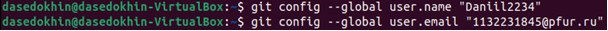{#fig:001 width=100%}

3.1.2. Настройка utf-8 в выводе сообщений git. (рис. @fig:002)

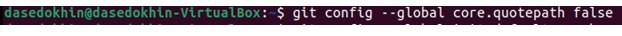{#fig:002 width=100%}

3.1.3. Задаём имя начальной ветке. (рис. @fig:003)

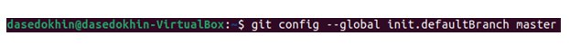{#fig:003 width=100%}

3.1.4. Параметр autocrlf. (рис. @fig:004)

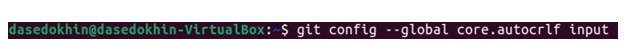{#fig:004 width=100%}

3.1.5. Параметр safecrlf. (рис. @fig:005)

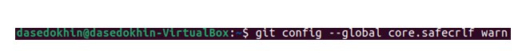{#fig:005 width=100%}

3.2 Создание SSH ключа

3.2.1. Для идентификации пользователя на сервере репозиториев генерируем несколько ключей. (рис. @fig:006)

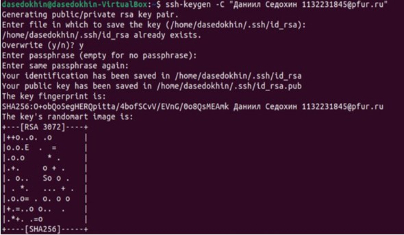{#fig:006 width=100%}

3.2.2. Теперь нам необходимо загрузить сгенерированный открытый ключ. Для этого заходим на сайт http://github.org/ под своей учётной записью и переходим в меню «Setting». После этого выбираем в боковом меню «SSH and GPG keys» и нажимаем на кнопку «New SSH key». Вставляем ключ в появившееся на сайте поле и указываем для ключа имя (Title). (рис. @fig:007)

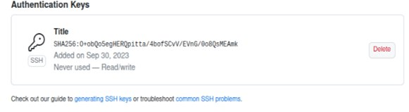{#fig:007 width=100%}

3.2.3. Копируем из локальной консоли ключ в буфер обмена. (рис. @fig:008)

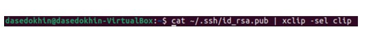{#fig:008 width=100%}

3.3 Создание рабочего пространства и репозитория курса на основе шаблона

3.3.1. Создаём каталог для предмета «Архитектура компьютера». (рис. @fig:009)

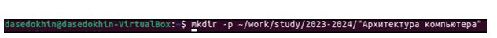{#fig:009 width=100%}

3.4 Создание репозитория курса на основе шаблона

3.4.1. Переходим на страницу репозитория с шаблоном курса https://github.com/yamadharma/course-directory-student-template. Задаём имя репозитория и создаём его. (рис. @fig:0010)

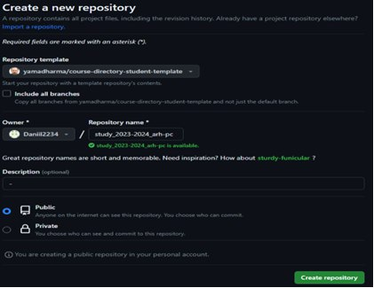{#fig:0010 width=100%}

3.4.2. Переходим в каталог курса. (рис. @fig:0011)

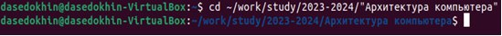{#fig:0011 width=100%}

3.4.3. Клонируем созданный репозиторий. (рис. @fig:0012)

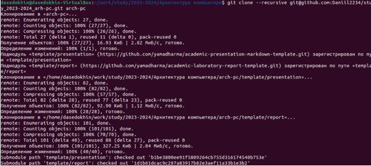{#fig:0012 width=100%}

3.4.4. Предварительно перед копированием копируем ссылку для клонирования на странице созданного репозитория. (рис. @fig:0013)

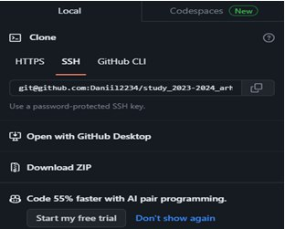{#fig:0013 width=100%}

3.5 Настройка каталога курса

3.5.1. Переходим в каталог курса. (рис. @fig:0014)

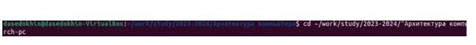{#fig:0014 width=100%}

3.5.2. Удаление лишних файлов. (рис. @fig:0015)

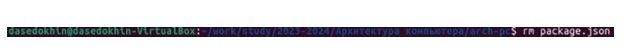{#fig:0015 width=100%}

3.5.3. Создание необходимых каталогов. (рис. @fig:0016)

{#fig:0016 width=100%}

3.5.4. Отправка файлов на сервер. (рис. @fig:0017 @fig:0018)

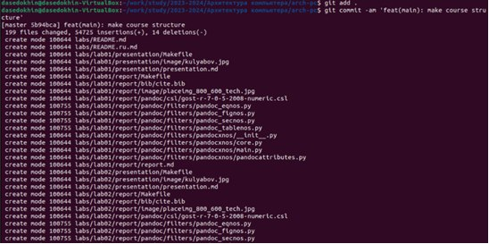{#fig:0017 width=100%}

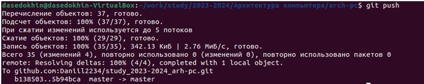{#fig:0018 width=100%}

3.6 Задание для самостоятельной работы

3.6.1. Создаём отчёт по выполнению лабораторной работы в соответствующем каталоге рабочего пространства (labs>lab02>report). Копируем отчёты по выполнению предыдущих лабораторных работ в соответствующие каталоги созданного рабочего пространства и загружаем файлы на github. (рис. @fig:0019 @fig:0020 @fig:0021)

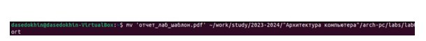{#fig:0019 width=100%}

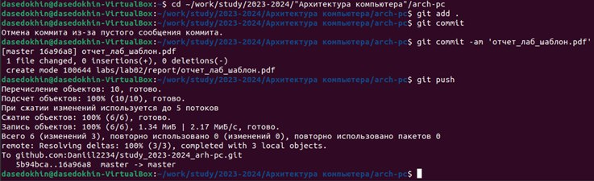{#fig:0021 width=100%}

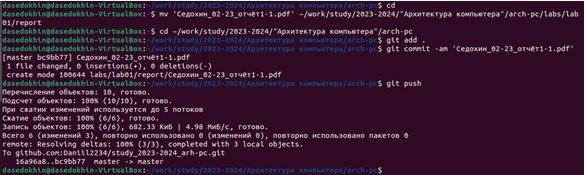{#fig:0021 width=100%}

# Выводы
В ходе выполнения лабораторной работы №2 я изучил идеологию и применение средств контроля версий. Приобрёл практические навыки по работе с системой git.

