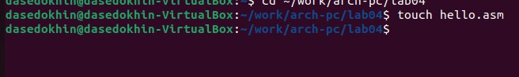
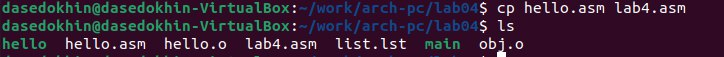
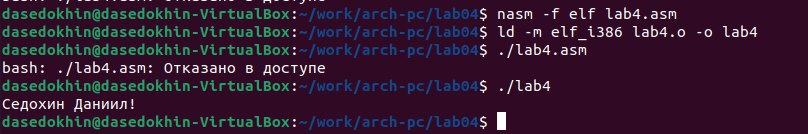

---
## Front matter
title: "Лабораторная работа №4"
subletit: "Создание и процесс обработки программ на языке ассемблера NASM"
author: "Седохин Даниил Алексеевич"

## Generic otions
lang: ru-RU
toc-title: "Содержание"

## Bibliography
bibliography: bib/cite.bib
csl: pandoc/csl/gost-r-7-0-5-2008-numeric.csl

## Pdf output format
toc: true # Table of contents
toc-depth: 2
lof: true # List of figures
lot: false # List of tables
fontsize: 12pt
linestretch: 1.5
papersize: a4
documentclass: scrreprt
## I18n polyglossia
polyglossia-lang:
  name: russian
  options:
	- spelling=modern
	- babelshorthands=true
polyglossia-otherlangs:
  name: english
## I18n babel
babel-lang: russian
babel-otherlangs: english
## Fonts
mainfont: PT Serif
romanfont: PT Serif
sansfont: PT Sans
monofont: PT Mono
mainfontoptions: Ligatures=TeX
romanfontoptions: Ligatures=TeX
sansfontoptions: Ligatures=TeX,Scale=MatchLowercase
monofontoptions: Scale=MatchLowercase,Scale=0.9
## Biblatex
biblatex: true
biblio-style: "gost-numeric"
biblatexoptions:
  - parentracker=true
  - backend=biber
  - hyperref=auto
  - language=auto
  - autolang=other*
  - citestyle=gost-numeric
## Pandoc-crossref LaTeX customization
figureTitle: "Рис."
tableTitle: "Таблица"
listingTitle: "Листинг"
lofTitle: "Список иллюстраций"
lolTitle: "Листинги"
## Misc options
indent: true
header-includes:
  - \usepackage{indentfirst}
  - \usepackage{float} # keep figures where there are in the text
  - \floatplacement{figure}{H} # keep figures where there are in the text
---

# Цель работы
Освоение процедуры компиляции и сборки программ, написанных на ассемблере NASM.

# Выполнение лабораторной работы
1) Создадим каталог для работы с программами на языке ассемблера NASM с помощью следующей команды. (рис. @fig:001).

{#fig:001 width=100%} 

2) Перейдём в созданный каталог. (рис. @fig:002).

{#fig:002 width=100%}

3) Создадим текстовый файл с именем "hello.asm". (рис. @fig:003).

{#fig:003 width=100%}

4) Откройте этот файл с помощью любого текстового редактора, например, gedit (рис. @fig:004).

{#fig:004 width=100%}

5) Введём в него следующий текст: (рис. @fig:005).

{#fig:005 width=100%}

6) Для компиляции приведённого выше текста программы «Hello World» напишем следующую команду и проверим с помощью "ls" (рис. @fig:006).

{#fig:006 width=100%}

7) Выполним следующую команду. Данная команда скомпилирует исходный файл hello.asm в obj.o (опция -o позволяет
задать имя объектного файла, в данном случае obj.o), при этом формат выходного файла
будет elf, и в него будут включены символы для отладки (опция -g), кроме того, будет создан
файл листинга list.lst (опция -l). Проверим созданные файлы с помощью команды "ls". (рис. @fig:007).

{#fig:007 width=100%}

8) Для получения списка форматов объект-ного файла см. nasm -hf. (рис. @fig:008).

{#fig:008 width=100%}

9) Чтобы получить исполняемую программу, объектный файл необходимо передать на обработку компоновщику с помощью следующей комнады: (рис. @fig:009). 
 
{#fig:009 width=100%}
 
10) Проверим созданные файлы с помощью команды "ls". (рис. @fig:010)

{#fig:010 width=100%}

11) Ключ -o с последующим значением задаёт в данном случае имя создаваемого исполняемого файла. Выполним следующую команду: (рис. @fig:011).

{#fig:011 width=100%}

12) Формат командной строки LD можно увидеть, набрав ld --help. (рис. @fig:012).

{#fig:012 width=100%}

13) Для получения более подробной информации см. man ld. (рис. @fig:013).

{#fig:013 width=100%}

14) Запустить на выполнение созданный исполняемый файл, находящийся в текущем каталоге, можно, набрав в командной строке: (рис. @fig:014).

{#fig:014 width=100%}

# Задание для самостоятельной работы

1) В каталоге ~/work/arch-pc/lab04 с помощью команды cp создадим копию файла hello.asm с именем lab4.asm (рис. @fig:015).

{#fig:015 width=100%}

2) С помощью любого текстового редактора внесите изменения в текст программы в
файле lab4.asm так, чтобы вместо Hello world! на экран выводилась строка с вашими
фамилией и именем. (рис. @fig:016).

{#fig:016 width=100%}

3) Скопируйте файлы hello.asm и lab4.asm в Ваш локальный репозиторий в каталог ~/work/study/2023-2024/"Архитектура компьютера"/arch-pc/labs/lab04/. (рис. @fig:017).

{#fig:017 width=100%}

4) Загрузим файлы на Github. (рис. @fig:018).

{#fig:0018 width=100%}

# Выводы
Мы освоили процедуры компиляции и сборки программ, написанных на ассемблере NASM.
