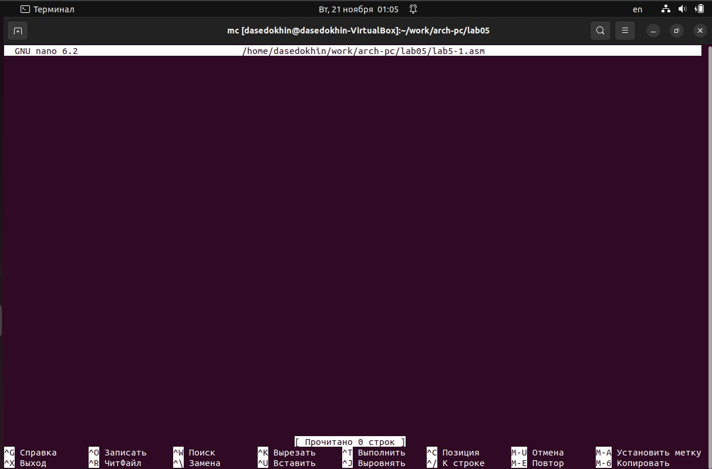

---
## Front matter
title: "Лабораторная работа №5"
subletit: "Основы работы с Midnight Commander (mc). Структура программы на языке ассемблера NASM. Системные вызовы в ОС GNU Linux"
author: "Седохин Даниил Алексеевич"

## Generic otions
lang: ru-RU
toc-title: "Содержание"

## Bibliography
bibliography: bib/cite.bib
csl: pandoc/csl/gost-r-7-0-5-2008-numeric.csl

## Pdf output format
toc: true # Table of contents
toc-depth: 2
lof: true # List of figures
lot: false # List of tables
fontsize: 12pt
linestretch: 1.5
papersize: a4
documentclass: scrreprt
## I18n polyglossia
polyglossia-lang:
  name: russian
  options:
	- spelling=modern
	- babelshorthands=true
polyglossia-otherlangs:
  name: english
## I18n babel
babel-lang: russian
babel-otherlangs: english
## Fonts
mainfont: PT Serif
romanfont: PT Serif
sansfont: PT Sans
monofont: PT Mono
mainfontoptions: Ligatures=TeX
romanfontoptions: Ligatures=TeX
sansfontoptions: Ligatures=TeX,Scale=MatchLowercase
monofontoptions: Scale=MatchLowercase,Scale=0.9
## Biblatex
biblatex: true
biblio-style: "gost-numeric"
biblatexoptions:
  - parentracker=true
  - backend=biber
  - hyperref=auto
  - language=auto
  - autolang=other*
  - citestyle=gost-numeric
## Pandoc-crossref LaTeX customization
figureTitle: "Рис."
tableTitle: "Таблица"
listingTitle: "Листинг"
lofTitle: "Список иллюстраций"
lolTitle: "Листинги"
## Misc options
indent: true
header-includes:
  - \usepackage{indentfirst}
  - \usepackage{float} # keep figures where there are in the text
  - \floatplacement{figure}{H} # keep figures where there are in the text
---

# Цель работы
Приобретение практических навыков работы в Midnight Commander. Освоение инструкций
языка ассемблера mov и int.

# Выполнение лабораторной работы
1) Откроем Midnight Commander. (рис. @fig:001).

{#fig:001 width=100%} 

2) Пользуясь клавишами ↑ , ↓ и Enter перейдём в каталог ~/work/arch-pc созданный при выполнении лабораторной работы №4. (рис. @fig:002).

{#fig:002 width=100%}

3) С помощью функциональной клавиши F7 создадим папку lab05 и перейдём в созданный каталог. (рис. @fig:003).

{#fig:003 width=100%}

4) Пользуясь строкой ввода и командой touch создадим файл lab5-1.asm  (рис. @fig:004).

{#fig:004 width=100%}

5) С помощью функциональной клавиши F4 откроем файл lab5-1.asm для редактирования во встроенном редакторе. Как правило в качестве встроенного редактора Midnight Commander используется редакторы nano или mcedit. (рис. @fig:005).

{#fig:005 width=100%}

6) Введём текст программы из листинга 5.1 , сохраним изменения и закроем файл. (рис. @fig:006).

{#fig:006 width=100%}

7) С помощью функциональной клавиши F3 откроем файл lab5-1.asm для просмотра. Убедимся, что файл содержит текст программы. (рис. @fig:007).

{#fig:007 width=100%}

8) Оттранслируем текст программы lab5-1.asm в объектный файл. Выполним компоновку объектного файла и запустим получившийся исполняемый файл. Программа выводит строку 'Введите строку:' и ожидает ввода с клавиатуры. На запрос вводим ФИО (рис. @fig:008 @fig:020).

{#fig:008 width=100%}

{#fig:020 width=100%}

9) Скачаем файл in_out.asm со страницы курса в ТУИС. Подключаемый файл in_out.asm должен лежать в том же каталоге, что и файл с программой, в которой он используется. В одной из панелей mc откроем каталог с файлом lab5-1.asm. В другой панели каталог со скаченным файлом in_out.asm (для перемещения между панелями используем Tab ).
Скопируем файл in_out.asm в каталог с файлом lab5-1.asm с помощью функциональной клавиши F5  (рис. @fig:009). 
 
{#fig:009 width=100%}
 
10) С помощью функциональной клавиши F6 создадим копию файла lab5-1.asm с именем lab5-2.asm. (рис. @fig:010).

{#fig:010 width=100%}

11) Исправим текст программы в файле lab5-2.asm с использование подпрограмм из внешнего файла in_out.asm (используем подпрограммы sprintLF, sread и quit) в соответствии с листингом 5.2. Создадим исполняемый файл и проверим его работу. (рис. @fig:011 @fig:021).

{#fig:011 width=100%}

{#fig:021 width=100%}

12) В файле lab5-2.asm заменим подпрограмму sprintLF на sprint. Создадим исполняемый файл и проверим его работу. Разница sprintLfF и sprint заключается в том, что подпрограмма sprintLF запрашивает ввод текста на следующей строке от выводимого сообщения, а sprint запрашивает ввод на той же строке. (рис. @fig:012 @fig:022).

{#fig:012 width=100%}

{#fig:022 width=100%}

# Задание для самостоятельной работы

1) Создадим копию файла lab5-1.asm. Внесём изменения в программу (без использования внешнего файла in_out.asm), так чтобы она работала по следующему алгоритму:
-  вывести приглашение типа “Введите строку:”;
-  ввести строку с клавиатуры;
-  вывести введённую строку на экран.  
Получим исполняемый файл и проверим его работу. (рис. @fig:013 @fig:023).

{#fig:013 width=100%}

{#fig:023 width=100%}

2) Создадим копию файла lab5-2.asm. Исправим текст программы с использование подпрограмм из внешнего файла in_out.asm, так чтобы она работала по следующему
алгоритму:
-  вывести приглашение типа “Введите строку:”;
-  ввести строку с клавиатуры;
-  вывести введённую строку на экран.  
Создадим исполняемый файл и проверим его работу. (рис. @fig:014 @fig:024).

{#fig:014 width=100%}

{#fig:024 width=100%}

3) Загрузим файлы на github. (рис. @fig:077).

{#fig:077 width=100%}

# Выводы
Я Приобрёл практические навыкы работы в Midnight Commander. Освоил инструкции языка ассемблера mov и int.
