---
## Front matter
title: "Лабораторная работа №6"
subletit: "Арифметические операции в NASM."
author: "Седохин Даниил Алексеевич"

## Generic otions
lang: ru-RU
toc-title: "Содержание"

## Bibliography
bibliography: bib/cite.bib
csl: pandoc/csl/gost-r-7-0-5-2008-numeric.csl

## Pdf output format
toc: true # Table of contents
toc-depth: 2
lof: true # List of figures
lot: false # List of tables
fontsize: 12pt
linestretch: 1.5
papersize: a4
documentclass: scrreprt
## I18n polyglossia
polyglossia-lang:
  name: russian
  options:
	- spelling=modern
	- babelshorthands=true
polyglossia-otherlangs:
  name: english
## I18n babel
babel-lang: russian
babel-otherlangs: english
## Fonts
mainfont: PT Serif
romanfont: PT Serif
sansfont: PT Sans
monofont: PT Mono
mainfontoptions: Ligatures=TeX
romanfontoptions: Ligatures=TeX
sansfontoptions: Ligatures=TeX,Scale=MatchLowercase
monofontoptions: Scale=MatchLowercase,Scale=0.9
## Biblatex
biblatex: true
biblio-style: "gost-numeric"
biblatexoptions:
  - parentracker=true
  - backend=biber
  - hyperref=auto
  - language=auto
  - autolang=other*
  - citestyle=gost-numeric
## Pandoc-crossref LaTeX customization
figureTitle: "Рис."
tableTitle: "Таблица"
listingTitle: "Листинг"
lofTitle: "Список иллюстраций"
lolTitle: "Листинги"
## Misc options
indent: true
header-includes:
  - \usepackage{indentfirst}
  - \usepackage{float} # keep figures where there are in the text
  - \floatplacement{figure}{H} # keep figures where there are in the text
---

# Цель работы
Освоение арифметических инструкций языка ассемблера NASM.

# Выполнение лабораторной работы
1) Создаём каталог для программам лабораторной работы № 6, перейдём в него и создадим файл lab6-1.asm (рис. @fig:001).

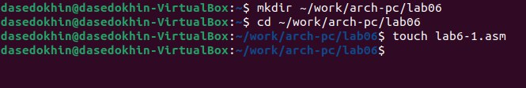{#fig:001 width=100%} 

2) Рассмотрим примеры программ вывода символьных и численных значений. Программы будут выводить значения записанные в регистр eax. Введём в файл lab6-1.asm текст программы из листинга 6.1. (рис. @fig:002).             
В данной программе в регистр eax записывается символ 6 (mov eax,'6'), в регистр ebx символ 4 (mov ebx,'4').
Далее к значению в регистре eax прибавляем значение регистра ebx (add eax,ebx, результат сложения запишется в регистр eax). Далее выводим результат. Так как для работы функции sprintLF в регистр eax должен быть записан адрес, необходимо использовать дополнительную переменную. Для этого запишем значение регистра eax в переменную buf1
(mov [buf1],eax), а затем запишем адрес переменной buf1 в регистр eax (mov eax,buf1) и вызовем функцию sprintLF. 

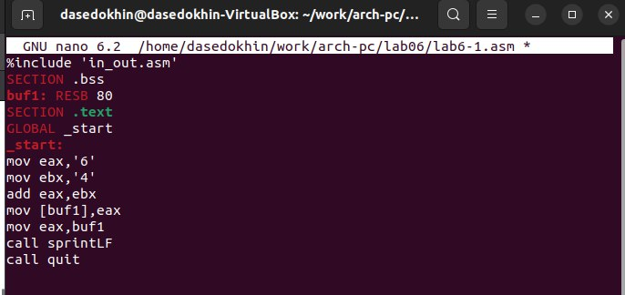{#fig:002 width=100%}

3) Создадим исполняемый файл и проверим его. (рис. @fig:003).    
Пояснение: В данном случае при выводе значения регистра eax мы ожидаем увидеть число 10. Однако
результатом будет символ j. Это происходит потому, что код символа 6 равен 00110110 в двоичном представлении (или 54 в десятичном представлении), а код символа 4 – 00110100 (52). Команда add eax,ebx запишет в регистр eax сумму кодов – 01101010 (106), что в свою
очередь является кодом символа j.

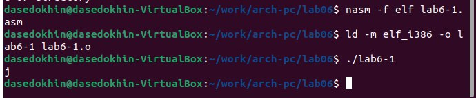{#fig:003 width=100%}

4) Далее изменим текст программы и вместо символов, запишем в регистры числа. Исправим текст программы (Листинг 6.1). (рис. @fig:004).  

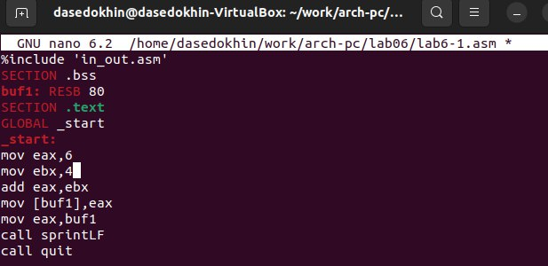{#fig:004 width=100%}
  
Создадим исполняемый файл и запустим его. (рис. @fig:005).  

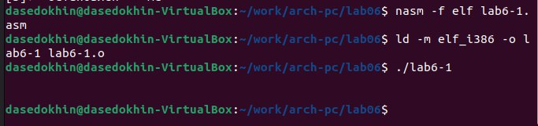{#fig:005 width=100%}

Как и в предыдущем случае при исполнении программы мы не получим число 10. В данном случае выводится символ с кодом 10. Пользуясь таблицей ASCII определим какому символу соответствует код 10. (рис. @fig:006).  
Данный символ не отображается на экране. 

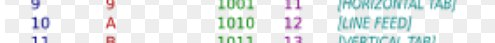{#fig:006 width=100%}

5) Как отмечалось выше, для работы с числами в файле in_out.asm реализованы подпрограммы для преобразования ASCII символов в числа и обратно. Преобразуем текст программы из Листинга 6.1 с использованием этих функций.
Создадим файл lab6-2.asm в каталоге ~/work/arch-pc/lab06 . (рис. @fig:007).  

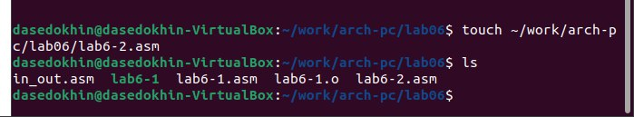{#fig:007 width=100%}

Введём в него текст программы из листинга 6.2 (рис. @fig:008).

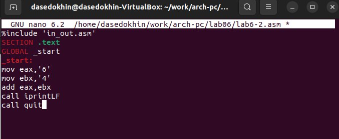{#fig:008 width=100%}

Создадим исполняемый файл и запустим его. (рис. @fig:009)

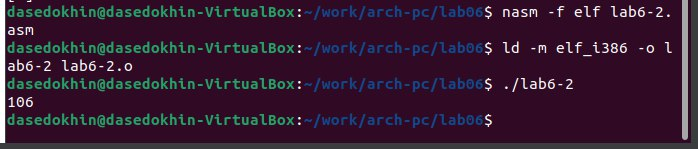{#fig:009 width=100%}

В результате работы программы мы получим число 106. В данном случае, как и в первом,
команда add складывает коды символов ‘6’ и ‘4’ (54+52=106). Однако, в отличии от программы
из листинга 6.1, функция iprintLF позволяет вывести число, а не символ, кодом которого
является это число.

6) Аналогично предыдущему примеру изменим символы на числа, Заменив строки. (рис. @fig:0010).

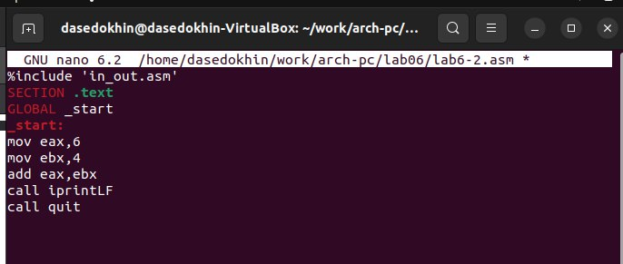{#fig:0010 width=100%}

Создадим исполняемый файл и запустим его. (рис. @fig:0011).  

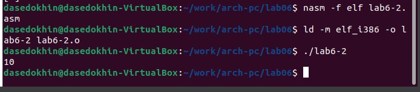{#fig:0011 width=100%}

В результате при запуске исполняемого файла мы получаем число 10.  

Заменим функцию iprintLF на iprint. (рис. @fig:0012).  

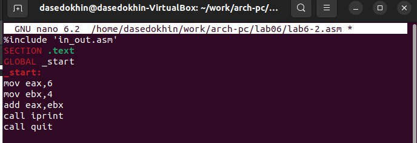{#fig:0012 width=100%}

Создадим исполняемый файл и запустим его. (рис. @fig:0013).

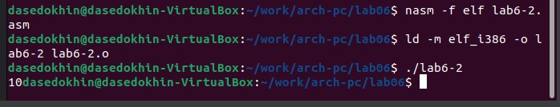{#fig:0013 width=100%}

Вывод функции iprintLF отличается от функции inprint тем, что выводимое число не записывается на отдельной строке при использовании функции inprint.

7) В качестве примера выполнения арифметических операций в NASM приведем программу вычисления арифметического выражения 𝑓(𝑥) = (5 ∗ 2 + 3)/3.
Создадим файл lab6-3.asm в каталоге ~/work/arch-pc/lab06 (рис. @fig:0014).

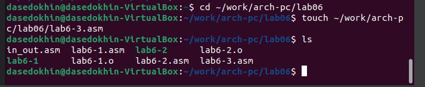{#fig:0014 width=100%}

8) Введём в lab6-3.asm текст из листинга 6.3 (рис. @fig:0015).

{#fig:0015 width=100%}

9) Создадим исполняемый файл и запустим его. (рис. @fig:0016). 
 
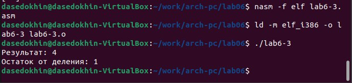{#fig:0016 width=100%}
 
10) Изменим текст программы для вычисления выражения 𝑓(𝑥) = (4 ∗ 6 + 2)/5. (рис. @fig:0017).  

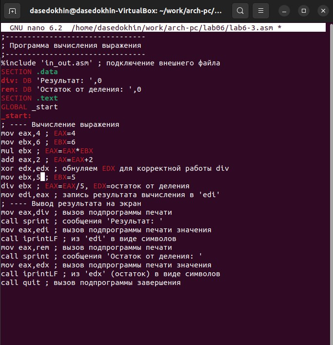{#fig:0017 width=100%}

Создадим исполняемый файл и проверим его работу. (рис. @fig:0018).

{#fig:0018 width=100%}

11) В качестве другого примера рассмотрим программу вычисления варианта задания пономеру студенческого билета, работающую по следующему алгоритму:
- вывести запрос на введение № студенческого билета
- вычислить номер варианта по формуле: (𝑆𝑛 mod 20) + 1, где 𝑆𝑛 – номер студенческого билета (В данном случае 𝑎 mod 𝑏 – это остаток от деления 𝑎 на 𝑏).
- вывести на экран номер варианта.  
В данном случае число, над которым необходимо проводить арифметические операции, вводится с клавиатуры. Как отмечалось выше ввод с клавиатуры осуществляется в символьном виде и для корректной работы арифметических операций в NASM символы необходимо преобразовать в числа. Для этого может быть использована функция atoi из файла in_out.asm.  
Создадим файл variant.asm в каталоге ~/work/arch-pc/lab06 (рис. @fig:0019).

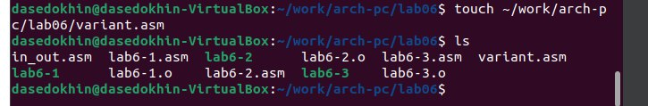{#fig:0019 width=100%}

Введём в файл variant.asm текст из листинга 6.4 (рис. @fig:0020).

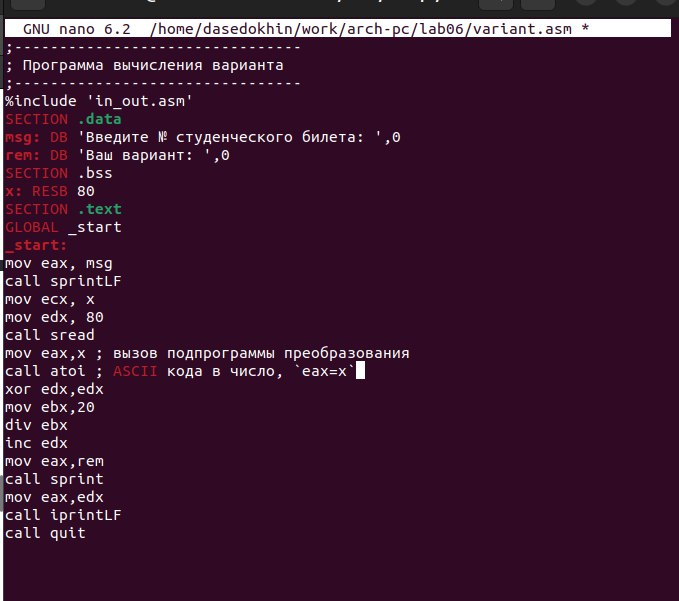{#fig:0020 width=100%}

Создадим исполняемый файл и проверим его. (рис. @fig:0021).

{#fig:0021 width=100%}

При аналитическом вычислении номера варианта результат совпал с результатом работы программы.

## Ответы на вопросы:

1)  За вывод строки ***Ваш вариант:*** отвечают 2 строки:
**mov eax,rem**
**call sprint**

2) Объявляется перемнная, под неё выделяется 80 байт, а затем вызывается функция которая отвечает за ввод строки пользователем в ранее обяъявленную переменную.

3) Это функция преобразования ascii-код символа в целое число

4) За вычисление варианта отвечает следующая последовательность строк -
**xor edx,edx**
**mov ebx,20**
**div ebx**
**inc edx**

5) Запись происходит в регистр edx.

6) Данная инструкция пребовляет 1 к значению регистра edx.

7) Строки -
**mov eax,edx**
**call iprintLF**

отвечают за вывод результата вычеслений в консоль

# Задание для самостоятельной работы

 Загрузим файлы на github. (рис. @fig:077).

{#fig:077 width=100%}

# Выводы
Я освоил арифметические инструкции языка ассемблера NASM.
