---
## Front matter
title: "Лабораторная работа №7"
subtitle: "Команды безусловного и условного переходов в Nasm. Программирование ветвлений."
author: "Седохин Даниил Алексеевич"

## Generic otions
lang: ru-RU
toc-title: "Содержание"

## Bibliography
bibliography: bib/cite.bib
csl: pandoc/csl/gost-r-7-0-5-2008-numeric.csl

## Pdf output format
toc: true # Table of contents
toc-depth: 2
lof: true # List of figures
lot: false # List of tables
fontsize: 12pt
linestretch: 1.5
papersize: a4
documentclass: scrreprt
## I18n polyglossia
polyglossia-lang:
  name: russian
  options:
	- spelling=modern
	- babelshorthands=true
polyglossia-otherlangs:
  name: english
## I18n babel
babel-lang: russian
babel-otherlangs: english
## Fonts
mainfont: PT Serif
romanfont: PT Serif
sansfont: PT Sans
monofont: PT Mono
mainfontoptions: Ligatures=TeX
romanfontoptions: Ligatures=TeX
sansfontoptions: Ligatures=TeX,Scale=MatchLowercase
monofontoptions: Scale=MatchLowercase,Scale=0.9
## Biblatex
biblatex: true
biblio-style: "gost-numeric"
biblatexoptions:
  - parentracker=true
  - backend=biber
  - hyperref=auto
  - language=auto
  - autolang=other*
  - citestyle=gost-numeric
## Pandoc-crossref LaTeX customization
figureTitle: "Рис."
tableTitle: "Таблица"
listingTitle: "Листинг"
lofTitle: "Список иллюстраций"
lolTitle: "Листинги"
## Misc options
indent: true
header-includes:
  - \usepackage{indentfirst}
  - \usepackage{float} # keep figures where there are in the text
  - \floatplacement{figure}{H} # keep figures where there are in the text
---

# Цель работы
Изучить команды условного и безусловного переходов. Приобрести навыки написания программ с использованием переходов. Ознакомиться с назначением и структурой файла листинга.

# Выполнение лабораторной работы
1) Создадим каталог для лабораторной работы № 7, перейдём в него и создадим файл lab7-1.asm (рис. @fig:001).

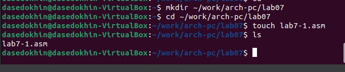{#fig:001 width=100%} 

2) Инструкция jmp в NASM используется для реализации безусловных переходов. Рассмотрим пример программы с использованием инструкции jmp. Введём в файл lab7-1.asm текст программы из листинга 7.1. (рис. @fig:002).

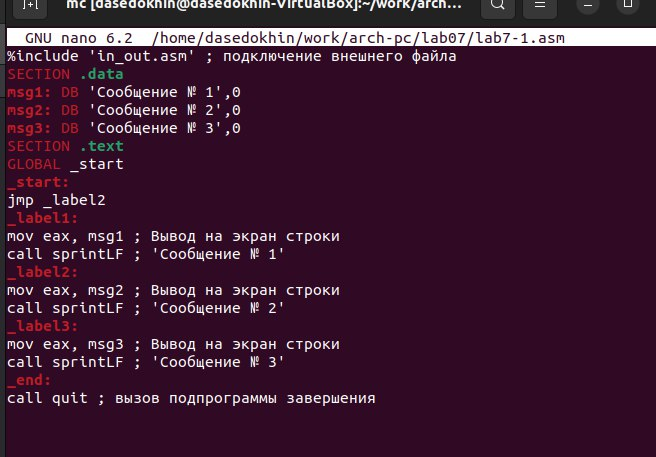{#fig:002 width=100%}

Создадим исполняемый файл и запустим его. (рис. @fig:003).

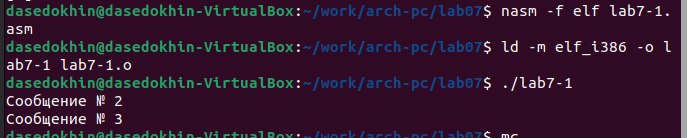{#fig:003 width=100%}

Инструкция jmp позволяет осуществлять переходы не только вперед но и назад. Изменим программу таким образом, чтобы она выводила сначала ‘Сообщение № 2’, потом ‘Сообщение № 1’ и завершала работу. Для этого в текст программы после вывода сообщения № 2 добавим инструкцию jmp с меткой _label1 (т.е. переход к инструкциям вывода сообщения № 1)
и после вывода сообщения № 1 добавим инструкцию jmp с меткой _end (т.е. переход к инструкции call quit). Изменим текст программы в соответствии с листингом 7.2 (рис. @fig:004).

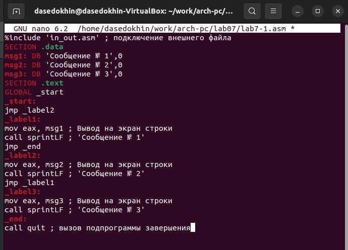{#fig:004 width=100%}
 
Создадим исполняемый файл и проверим его работу. (рис. @fig:005).

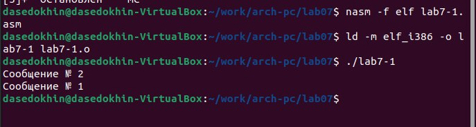{#fig:005 width=100%}
 
Изменим текст программы добавив или изменив инструкции jmp, чтобы вывод программы был следующим: (рис. @fig:006).  
Сообщение № 3  
Сообщение № 2  
Сообщение № 1  

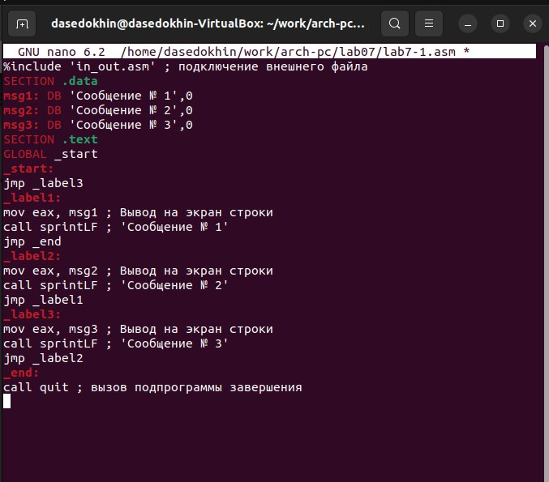{#fig:006 width=100%}

Создадим исполняемый файл и проверим его. (рис. @fig:007).    

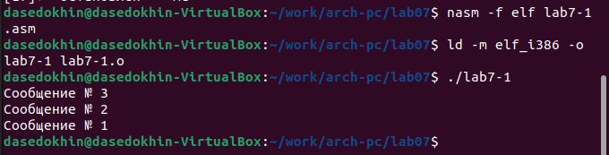{#fig:007 width=100%}

3) Использование инструкции jmp приводит к переходу в любом случае. Однако, часто при написании программ необходимо использовать условные переходы, т.е. переход должен происходить если выполнено какое-либо условие. В качестве примера рассмотрим программу, которая определяет и выводит на экран наибольшую из 3 целочисленных переменных: A,B и C. Значения для A и C задаются в программе, значение B вводиться с
клавиатуры.
Создадим файл lab7-2.asm в каталоге ~/work/arch-pc/lab07. (рис. @fig:008).  

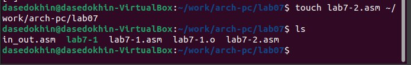{#fig:008 width=100%}

Введём текст программы из листинга 7.3 в lab7-2.asm. (рис. @fig:009).  

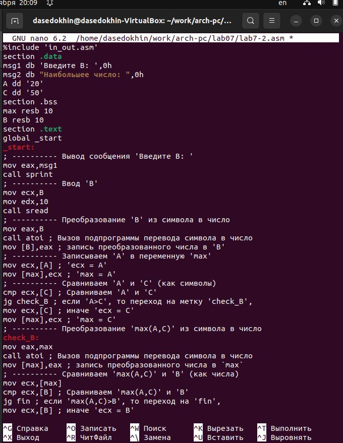{#fig:009 width=100%}
  
Создадим исполняемый файл и проверим его работу для разных значений B. (рис. @fig:0010).  

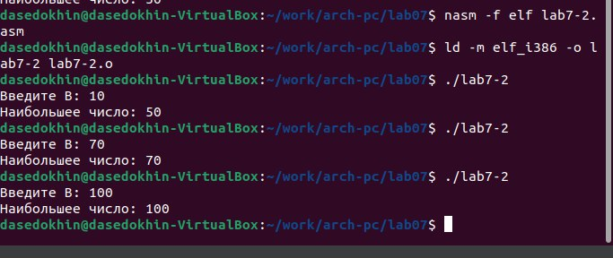{#fig:0010 width=100%}

4) Создадим файл листинга для программы из файла lab7-2.asm. (рис. @fig:0011).

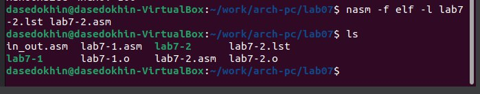{#fig:0011 width=100%}

Откроем файл листинга lab7-2.lst с помощью любого текстового редактора mcedit. (рис. @fig:0012).

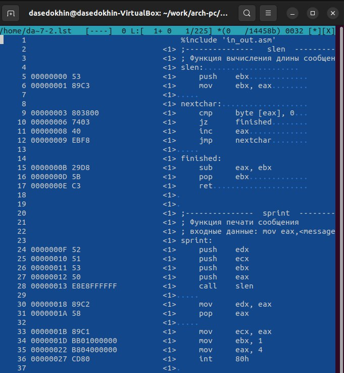{#fig:0012 width=100%}

Три строки выбранных мною следующие: (рис. @fig:0013):
- 45 - строчка, 00000159 адрес, B8[13000000] - машинный код, mov eax, msg2 - исходный тест программы. В котором записывается адрес msg2 в EAX.
- 46 - строчка, 0000015E адрес, E8ACFEFFFF - машинный код, call sprint -
исходный тест программы. В котором вызывается функция sprint. Она в
свою очередь выводит собщение содержащееся в переменной msg2
- 47 - строчка, 00000163 адрес, A1[00000000] - машинный код, mov eax,[max] - исходный тест программы. В котором записывается адрес переменной
[max] в EAX.

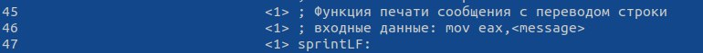{#fig:0013 width=100%}

Откроем файл с программой lab7-2.asm и уберём операнд из 14 строки. (рис. @fig:0014).

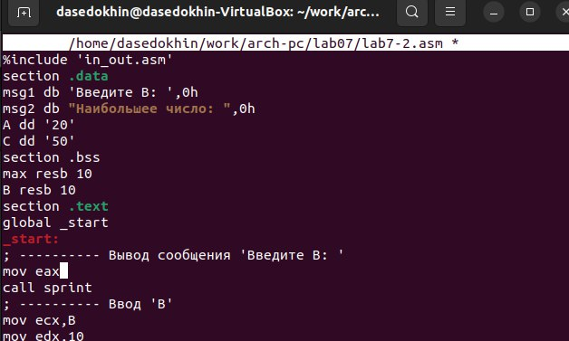{#fig:0014 width=100%}

Создадим файл листинга в котором на 14 строке появилась ошибка в связи с нашими изменениями операнды. (рис. @fig:0015 @fig:0016).
 
{#fig:0015 width=100%}

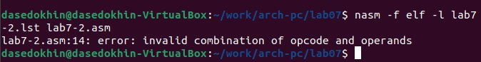{#fig:0016 width=100%}

# Задание для самостоятельной работы

Напишем программу нахождения наименьшей из 3 целочисленных переменных a,b и с. Значения переменных будут равны (79,83,41) в соответствии с 6-м вариантом.  

Для начала создадим файл srab1.asm в каталоге ~/work/arch-pc/lab07. (рис. @fig:0017).

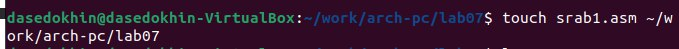{#fig:0017 width=100%}

За основу программы возьмём текст из листинга 7.3. Внесём необходимые изменения в текст файла. (рис. @fig:0018).

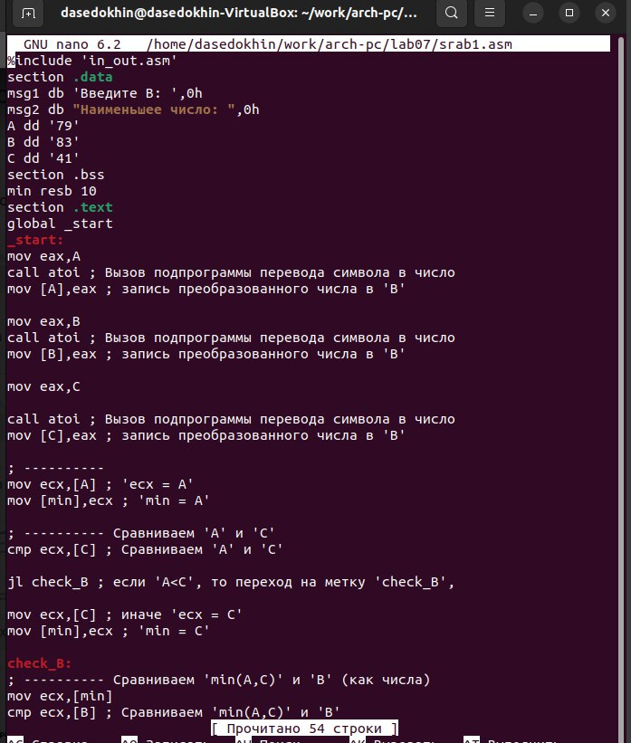{#fig:0018 width=100%}

***Изменённый текст файла srab1.asm***

```

%include 'in_out.asm'
section .data
msg2 db "Наименьшее число: ",0h
A dd '79'
B dd '83'
C dd '41'
section .bss
min resb 10
section .text
global _start
_start:


mov eax,A
call atoi ; Вызов подпрограммы перевода символа в число
mov [A],eax ; запись преобразованного числа в 'B'

mov eax,B
call atoi ; Вызов подпрограммы перевода символа в число
mov [B],eax ; запись преобразованного числа в 'B'

mov eax,C
call atoi ; Вызов подпрограммы перевода символа в число
mov [C],eax ; запись преобразованного числа в 'B'

; ---------- 
mov ecx,[A] ; 'ecx = A'
mov [min],ecx ; 'min = A'

; ---------- Сравниваем 'A' и 'С'
cmp ecx,[C] ; Сравниваем 'A' и 'С'

jl check_B ; если 'A<C', то переход на метку 'check_B',

mov ecx,[C] ; иначе 'ecx = C'
mov [min],ecx ; 'min = C'

check_B:
; ---------- Сравниваем 'min(A,C)' и 'B' (как числа)
mov ecx,[min]
cmp ecx,[B] ; Сравниваем 'min(A,C)' и 'B'

jl fin
 
mov ecx,[B] ;иначе 'ecx = B'
mov [min],ecx
; ---------- Вывод результата
fin:
mov eax, msg2
call sprint ; Вывод сообщения 'Наибольшее число: '
mov eax,[min]
call iprintLF ; Вывод 'min(A,B,C)'
call quit ; Выход

```

Создадим исполняемый файл и проверим его работу. (рис. @fig:0019).

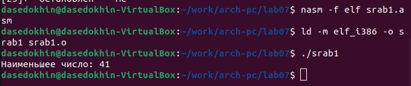{#fig:0019 width=100%}


# Выводы
Я изучил команды условного и безусловного переходов. Приобрёл навыки написания программ с использованием переходов. Ознакомился с назначением и структурой файла листинга.

