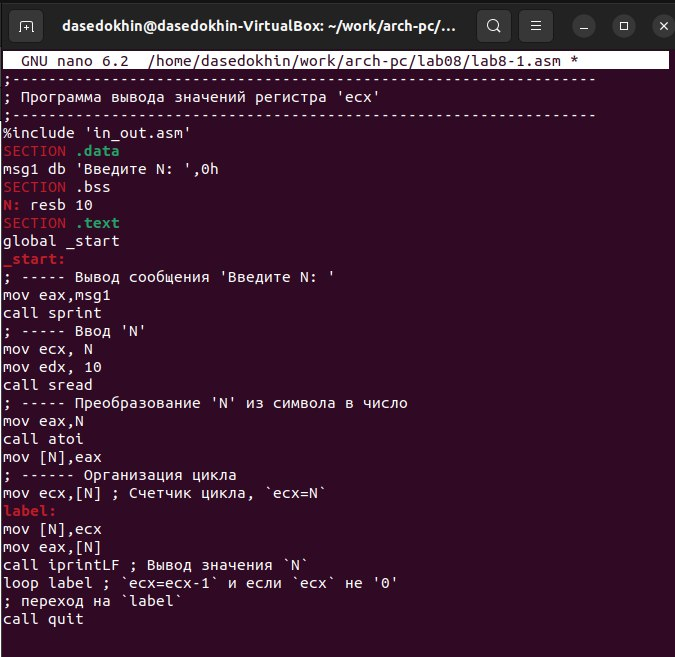
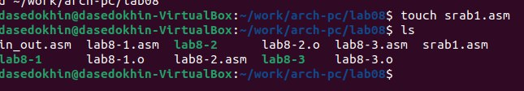
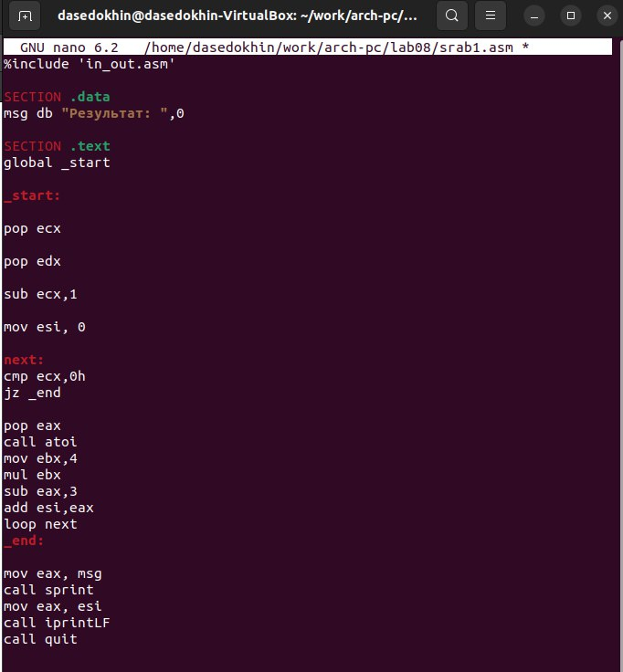

---
## Front matter
title: "Лабораторная работа №8"
subtitle: "Программирование
цикла. Обработка аргументов командной строки."
author: "Седохин Даниил Алексеевич"

## Generic otions
lang: ru-RU
toc-title: "Содержание"

## Bibliography
bibliography: bib/cite.bib
csl: pandoc/csl/gost-r-7-0-5-2008-numeric.csl

## Pdf output format
toc: true # Table of contents
toc-depth: 2
lof: true # List of figures
lot: false # List of tables
fontsize: 12pt
linestretch: 1.5
papersize: a4
documentclass: scrreprt
## I18n polyglossia
polyglossia-lang:
  name: russian
  options:
	- spelling=modern
	- babelshorthands=true
polyglossia-otherlangs:
  name: english
## I18n babel
babel-lang: russian
babel-otherlangs: english
## Fonts
mainfont: PT Serif
romanfont: PT Serif
sansfont: PT Sans
monofont: PT Mono
mainfontoptions: Ligatures=TeX
romanfontoptions: Ligatures=TeX
sansfontoptions: Ligatures=TeX,Scale=MatchLowercase
monofontoptions: Scale=MatchLowercase,Scale=0.9
## Biblatex
biblatex: true
biblio-style: "gost-numeric"
biblatexoptions:
  - parentracker=true
  - backend=biber
  - hyperref=auto
  - language=auto
  - autolang=other*
  - citestyle=gost-numeric
## Pandoc-crossref LaTeX customization
figureTitle: "Рис."
tableTitle: "Таблица"
listingTitle: "Листинг"
lofTitle: "Список иллюстраций"
lolTitle: "Листинги"
## Misc options
indent: true
header-includes:
  - \usepackage{indentfirst}
  - \usepackage{float} # keep figures where there are in the text
  - \floatplacement{figure}{H} # keep figures where there are in the text
---

# Цель работы
Приобрести навыки написания программ с использованием циклов и обработкой
аргументов командной строки.

# Выполнение лабораторной работы
1) Создадим каталог для программам лабораторной работы № 8, перейдём в него и создадим
файл lab8-1.asm: (рис. @fig:001).

{#fig:001 width=100%} 

2) При реализации циклов в NASM с использованием инструкции loop необходимо помнить
о том, что эта инструкция использует регистр ecx в качестве счетчика и на каждом шаге
уменьшает его значение на единицу. В качестве примера рассмотрим программу, которая
выводит значение регистра ecx. Введём в файл lab8-1.asm текст программы из листинга 8.1. (рис. @fig:002).

{#fig:002 width=100%}

Создадим исполняемый файл
и проверим его работу. (рис. @fig:003).

{#fig:003 width=100%}

Данный пример показывает, что использование регистра ecx в теле цилка loop может
привести к некорректной работе программы.  
Изменим текст программы добавив изменение
значение регистра ecx в цикле: (рис. @fig:004). 

{#fig:004 width=100%}
 
Создадим исполняемый файл и проверим его работу. (рис. @fig:005).

{#fig:005 width=100%}
 
Число проходов цикла не соответствуют введённому значению с клавиатуры. Программа обрабатывает только нечетные числа.

Для использования регистра ecx в цикле и сохранения корректности работы программы
можно использовать стек.  
Внесём изменения в текст программы добавив команды push
и pop (добавления в стек и извлечения из стека) для сохранения значения счетчика цикла loop (рис. @fig:006).

{#fig:006 width=100%}

Создадим исполняемый файл и проверим его. (рис. @fig:007).    

{#fig:007 width=100%}

В данном случае число переходов соответствует числу введённому с клавиатуры.

При разработке программ иногда встает необходимость указывать аргументы, которые
будут использоваться в программе, непосредственно из командной строки при запуске
программы.
При запуске программы в NASM аргументы командной строки загружаются в стек в обрат-
ном порядке, кроме того в стек записывается имя программы и общее количество аргументов.
Последние два элемента стека для программы, скомпилированной NASM, – это всегда имя
программы и количество переданных аргументов.
Таким образом, для того чтобы использовать аргументы в программе, их просто нужно
извлечь из стека. Обработку аргументов нужно проводить в цикле. Т.е. сначала нужно из-
влечь из стека количество аргументов, а затем циклично для каждого аргумента выполнить
логику программы. В качестве примера рассмотрим программу, которая выводит на экран
аргументы командной строки.  
Создадим файл lab8-2.asm в каталоге ~/work/arch-pc/lab08 (рис. @fig:008).

{#fig:008 width=100%}

Введём в него текст программы из листинга 8.2. (рис. @fig:009).

{#fig:009 width=100%}

Создание исполняемого файла и его запуск, с указанием аргументов. (рис. @fig:0010).

{#fig:0010 width=100%}

Программой было обработаны все 3 аргумента

Рассмотрим еще один пример программы которая выводит сумму чисел, которые пере-
даются в программу как аргументы. Создадим файл lab8-3.asm в каталоге ~/work/arch-pc/lab08 (рис. @fig:0011).

{#fig:0011 width=100%}

Введём в него текст программы из листинга 8.3. (рис. @fig:0012).

{#fig:0012 width=100%}

Создадим исполняемый файл и запустим его, указав аргументы. (рис. @fig:0013).

{#fig:0013 width=100%}

Изменим текст программы из листинга 8.3 для вычисления произведения аргументов командной строки. (рис. @fig:0014).

{#fig:0014 width=100%}

Создадим исполняемый файл и проверим его, указав аргументы. (рис. @fig:0015).

{#fig:0015 width=100%}

# Задание для самостоятельной работы

Создадим файл srab1.asm в каталоге ~/work/arch-pc/lab08 (рис. @fig:0016).

{#fig:0016 width=100%}

Напишем программу, которая находит сумму значений функции f(x) для
x = x1, x2, ..., xn, т.е. программа должна выводить значение f(x1) + f(x2) + ... + f(xn).
Значения xi передаются как аргументы. Вид функции f(x) возьмём из таблицы
8.1 вариантов заданий в соответствии с 6 вариантом. Моя функция будет следующей: f(x) = 4x - 3 (рис. @fig:0017).

{#fig:0017 width=100%}

Создадим исполняемый файл и проверим его работу на
нескольких наборах x = x1, x2, ..., xn (рис. @fig:0018).

{#fig:0018 width=100%}

# Выводы
Я приобрёл навыки написания программ с использованием циклов и обработкой
аргументов командной строки.
