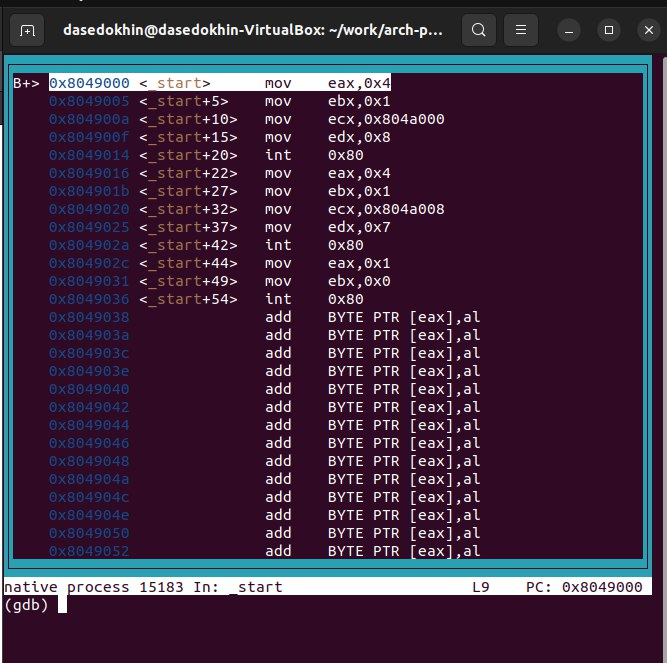

---
## Front matter
title: "Лабораторная работа №9"
subtitle: "Понятие подпрограммы.
Отладчик GDB."
author: "Седохин Даниил Алексеевич"

## Generic otions
lang: ru-RU
toc-title: "Содержание"

## Bibliography
bibliography: bib/cite.bib
csl: pandoc/csl/gost-r-7-0-5-2008-numeric.csl

## Pdf output format
toc: true # Table of contents
toc-depth: 2
lof: true # List of figures
lot: false # List of tables
fontsize: 12pt
linestretch: 1.5
papersize: a4
documentclass: scrreprt
## I18n polyglossia
polyglossia-lang:
  name: russian
  options:
	- spelling=modern
	- babelshorthands=true
polyglossia-otherlangs:
  name: english
## I18n babel
babel-lang: russian
babel-otherlangs: english
## Fonts
mainfont: PT Serif
romanfont: PT Serif
sansfont: PT Sans
monofont: PT Mono
mainfontoptions: Ligatures=TeX
romanfontoptions: Ligatures=TeX
sansfontoptions: Ligatures=TeX,Scale=MatchLowercase
monofontoptions: Scale=MatchLowercase,Scale=0.9
## Biblatex
biblatex: true
biblio-style: "gost-numeric"
biblatexoptions:
  - parentracker=true
  - backend=biber
  - hyperref=auto
  - language=auto
  - autolang=other*
  - citestyle=gost-numeric
## Pandoc-crossref LaTeX customization
figureTitle: "Рис."
tableTitle: "Таблица"
listingTitle: "Листинг"
lofTitle: "Список иллюстраций"
lolTitle: "Листинги"
## Misc options
indent: true
header-includes:
  - \usepackage{indentfirst}
  - \usepackage{float} # keep figures where there are in the text
  - \floatplacement{figure}{H} # keep figures where there are in the text
---

# Цель работы
Приобрести навыки написания программ с использованием подпрограмм. Ознакомиться 
с методами отладки при помощи GDB и его основными возможностями.

# Выполнение лабораторной работы
1) ССоздадим каталог для выполнения лабораторной работы № 9, перейдём в него и со-
здадим файл lab09-1.asm: (рис. @fig:001).

{#fig:001 width=100%} 

2) В качестве примера рассмотрим программу вычисления арифметического выражения
f(x) = 2x + 7 с помощью подпрограммы _calcul. В данном примере x вводится с
клавиатуры, а само выражение вычисляется в подпрограмме. Введём в файл lab9-1.asm текст программы из листинга 9.1. (рис. @fig:002).

{#fig:002 width=100%}

Создадим исполняемый файл
и проверим его работу. (рис. @fig:003).

{#fig:003 width=100%}

Изменим текст программы, добавив подпрограмму _subcalcul в подпрограмму _calcul,
для вычисления выражения f(g(x)), где x вводится с клавиатуры, f(x) = 2x + 7, g(x) =
3x − 1. Т.е. x передается в подпрограмму _calcul из нее в подпрограмму _subcalcul, где
вычисляется выражение g(x), результат возвращается в _calcul и вычисляется выражение
f(g(x)). Результат возвращается в основную программу для вывода результата на экран. Отредактируем текст программы (рис. @fig:004). 

{#fig:004 width=100%}
 
Создадим исполняемый файл и проверим его работу. (рис. @fig:005).

{#fig:005 width=100%}
 
Создадим файл lab09-2.asm с текстом программы из Листинга 9.2. (Программа печати
сообщения Hello world!) (рис. @fig:006).

{#fig:006 width=100%}

Введём в файл lab09-2.asm текст программы из листинга 9.2. (рис. @fig:007).    

{#fig:007 width=100%}

 Получм исполняемый файл. Для работы с GDB в исполняемый файл необходимо добавить
отладочную информацию, для этого трансляцию программ необходимо проводить с ключом
‘-g’. (рис. @fig:008).

{#fig:008 width=100%}

Загрузим исполняемый файл в отладчик gdb (рис. @fig:009).

{#fig:009 width=100%}

Проверим работу программы, запустив ее в оболочке GDB с помощью команды run (со-
кращённо r): (рис. @fig:0010).

{#fig:0010 width=100%}

Для более подробного анализа программы установим брейкпоинт на метку _start, с
которой начинается выполнение любой ассемблерной программы, и запустим её. (рис. @fig:0011).

{#fig:0011 width=100%}

Посмотрим дисассимилированный код программы с помощью команды disassemble
начиная с метки _start (рис. @fig:0012).

{#fig:0012 width=100%}

Переключим на отображение команд с Intel’овским синтаксисом, введя команду set
disassembly-flavor intel (рис. @fig:0013).

{#fig:0013 width=100%}

В ATT имена регистров начинаются с символа %, а имена опрерандов
с $, в то время как в intel используется привычный нам синтаксис.
Включим режим псевдографики для более удобного анализа программы и выведем значения регисторов (рис. @fig:0014 @fig:0015).

{#fig:0014 width=100%}

{#fig:0015 width=100%}

Установить точку останова можно командой break (кратко b). Типичный аргумент этой
команды — место установки. Его можно задать или как номер строки программы (имеет
смысл, если есть исходный файл, а программа компилировалась с информацией об отладке),
или как имя метки, или как адрес. Чтобы не было путаницы с номерами, перед адресом
ставится «звёздочка»:
На предыдущих шагах была установлена точка останова по имени метки (_start). Про-
верим это с помощью команды info breakpoints (кратко i b) (рис. @fig:0016).

{#fig:0016 width=100%}

Установим еще одну точку останова по адресу инструкции. Адрес инструкции можно
увидеть в средней части экрана в левом столбце соответствующей инструкции 
Определим адрес предпоследней инструкции (mov ebx,0x0) и установим точку останова. (рис. @fig:0017).

{#fig:0017 width=100%}

Посмотрим информацию о всех установленных точках останова (рис. @fig:0018).

{#fig:0018 width=100%}

С помощью команды x &<имя переменной> также можно посмотреть содержимое пере-
менной.
Посмотрим значение переменной msg1 и msg2 по имени (рис. @fig:0019).

{#fig:0019 width=100%}

Изменить значение для регистра или ячейки памяти можно с помощью команды set,
задав ей в качестве аргумента имя регистра или адрес. При этом перед именем регистра
ставится префикс $, а перед адресом нужно указать в фигурных скобках тип данных (раз-
мер сохраняемого значения; в качестве типа данных можно использовать типы языка Си).
Изменим первый символ переменной msg1 (рис. @fig:0020).

{#fig:0020 width=100%}

Заменим любой символ во второй переменной msg2. (рис. @fig:0021).

{#fig:0021 width=100%}

С помощью команды set изменим значение регистра ebx (рис. @fig:0022).

{#fig:0022 width=100%}

Разница вывода команд p/s $ebx отличается тем, что в первом случае мы переводим символ в его строковой вид, а во втором случае число в строковом виде не изменяется.

Завершим выполнение программы с помощью команды continue (сокращенно c) или
stepi (сокращенно si) и выйдем из GDB с помощью команды quit (сокращенно q).

Скопируем файл lab8-2.asm, созданный при выполнении лабораторной работы №8,
с программой выводящей на экран аргументы командной строки (Листинг 8.2) в файл с именем lab09-3.asm (рис. @fig:0023).

{#fig:0023 width=100%}

Создадим исполняемый файл (рис. @fig:0024).

{#fig:0024 width=100%}

Для загрузки в gdb программы с аргументами необходимо использовать ключ --args.
Загрузим исполняемый файл в отладчик, указав аргументы (рис. @fig:0025).

{#fig:0025 width=100%}

Как отмечалось в предыдущей лабораторной работе, при запуске программы аргументы
командной строки загружаются в стек. Исследуем расположение аргументов командной
строки в стеке после запуска программы с помощью gdb.
Для начала установим точку останова перед первой инструкцией в программе и запустим
ее. (рис. @fig:0026).

{#fig:0026 width=100%}

Адрес вершины стека храниться в регистре esp и по этому адресу располагается число
равное количеству аргументов командной строки (включая имя программы) (рис. @fig:0027).

{#fig:0027 width=100%}

Как видно, число аргументов равно 5 – это имя программы lab09-3 и непосредственно
аргументы: аргумент1, аргумент, 2 и 'аргумент 3'.
Посмотрим остальные позиции стека – по адесу [esp+4] располагается адрес в памяти
где находиться имя программы, по адесу [esp+8] храниться адрес первого аргумента, по
аресу [esp+12] – второго и т.д. (рис. @fig:0028).

{#fig:0028 width=100%}

# Задание для самостоятельной работы

Преобразуем программу из лабораторной работы №8 (Задание №1 для самостоятель-
ной работы), реализовав вычисление значения функции f(x) как подпрограмму. 

Для этого, сначала создадим файл lab09-4.asm и за основу текста его программы возьмём текст программы из прошлой лабораторной работы файла srab1.asm и отредактируем текст под нашу задачу (рис. @fig:0029).

{#fig:0029 width=100%}

Создадим исполняемый файл и проверим его работу (рис. @fig:0030).

{#fig:0030 width=100%}

 Создадим файл lab09-5.asm и введём в него екст программы из листинга 9.3 (рис. @fig:0031).

{#fig:0031 width=100%}

В листинге 9.3 приведена программа вычисления выражения (3 + 2) ∗ 4 + 5. При запуске данная программа дает неверный результат. Проверим, создав исполняемый файл. (рис. @fig:0032).

{#fig:0032 width=100%}

Получим исполняемый файл через gpd. Проверим с помощью команды
continue каждую точку останова и значения регистров. На основе этого внесём изменения в программу (рис. @fig:0033).

{#fig:0033 width=100%}

Создадим исполняемый файл и проверим его работу (рис. @fig:0034).

{#fig:0034 width=100%}

# Выводы
Я приобрёл навыки написания программ с использованием подпрограмм и ознакомился
с методами отладки при помощи GDB и его основными возможностями.

